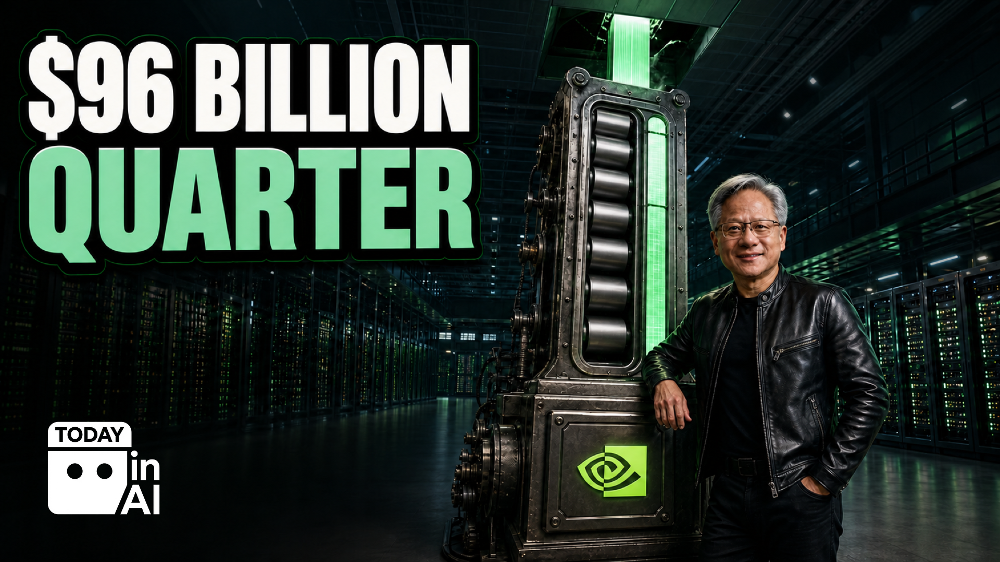

# Today in AI

An automated daily AI news brief that researches, verifies, writes, illustrates, and publishes itself to my LinkedIn and X every morning.

Live output, every day:

- LinkedIn: [linkedin.com/in/paytonbilodeau](https://www.linkedin.com/in/paytonbilodeau)
- X: [x.com/paytonbilodeau](https://x.com/paytonbilodeau)

## What it looks like

Every edition is one link-free post and one original 1920 by 1080 image, identical on both platforms. This is the August 27, 2026 edition, researched, written, illustrated, published, and verified by the system:

> Nvidia's $96 Billion Quarter:
>
> Nvidia made $96.2 billion in three months, more than double its revenue from the same quarter last year.
>
> [...]
>
> The AI gold rush has found the hardware store, and it is ordering by the million.
>
> [...]
>
> AI is no longer only a software story.
>
> It is becoming one of the largest physical construction and equipment cycles in technology history.

## What a daily run does

1. Reviews its own last seven editions so it never repeats a story angle, heading, joke structure, meme family, or image composition. A deterministic novelty check blocks publishing if it does.
2. Researches across three surfaces: official AI company and researcher accounts on X, major newsrooms and AI desks, and a full read of every AI newsletter in a dedicated inbox (TLDR AI, The Neuron, The Rundown, The AI Daily Brief, Ben's Bites, and any new sender it discovers).
3. Verifies every material claim against the best primary source. Company-reported numbers get labeled as company-reported. Previews and projections never read as shipped capability.
4. Scores every verified candidate on a weighted rubric: audience consequence and capability step-change at 3x, availability and evidence strength at 2x, salience and novelty at 1x. The biggest verified story must lead, and the run has to answer one question before writing: would a well-informed reader say this edition skipped the day's obvious biggest story?
5. Writes a 160 to 450 word edition in plain language for smart, non-technical adults. Event first, then the contradiction, the mechanism, the limitation, and the concrete consequence. Humor is allowed to be bold but can never change a fact.
6. Builds one original 16:9 image from sourced assets: real memes, real public figures, exact official logos provided as references (never approximated by the model), then stamps the brand badge at fixed pixel geometry.
7. Publishes the same link-free copy and image to LinkedIn and X through Postiz, verifies both receipts against live platform state, and appends the full run record to a log.

A run publishes only after every gate passes: accuracy, novelty, readability, an anti-AI-slop pass on the writing, image and logo QA, and account routing. If any gate fails, it publishes nothing and records the exact repair step instead.

## How it runs

The whole system is instructions plus small deterministic scripts. A scheduled agent task (Codex in the ChatGPT desktop app) reads the production packet in `prompts/`, follows the standing rules in `directives/`, and calls the Python scripts in `scripts/` for the parts that must never be left to model judgment: novelty checking, asset validation, badge placement, pre-publish gating, publishing, and cleanup.

That split is the design opinion this repo demonstrates: the model does research, judgment, and writing; deterministic code does verification, packaging, and publishing. Trust lives in the gates, not in the model's confidence.

## Repo layout

- `prompts/` — the production packet the scheduled agent runs from, plus the prompt used to update the standing task
- `directives/` — the standing editorial, image, and publishing rules (the system's constitution)
- `scripts/` — the deterministic Python: novelty check, asset validator, badge stamper, pre-publish gate, Postiz publisher, retention cleanup, and the reference scraper for studying pacing
- `context/` — accumulated context the run reads before working
- `templates/` — the daily image brief and the image asset manifest schema
- `docs/` — the process decomposition, the automation decision record, the maintenance plan, and the iteration log of every change to the system with the reason for it

## What's not here

This is a cleaned copy of the production system. Credentials live outside the repo in owner-only files under my home directory, loaded by path at runtime. No API keys, tokens, or account credentials exist anywhere in this repo, and the prompts explicitly forbid the agent from loading secrets out of the workspace. Some referenced files (voice guides, personal memory, research libraries) stay local by design, so a few paths in the prompts point at the production workspace rather than this repo.

## How it was built

I direct AI to build software. This system was built by describing what a trustworthy daily brief has to do, then iterating with Claude Code and Codex until every failure mode had a gate: duplicate posts, unverified claims, recycled jokes, broken logos, silent partial publishes. The iteration log in `docs/` records every one of those changes and why it was made.
